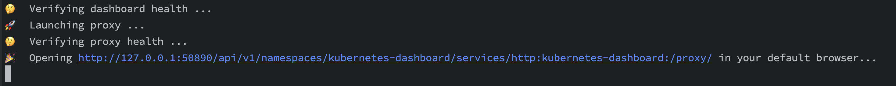
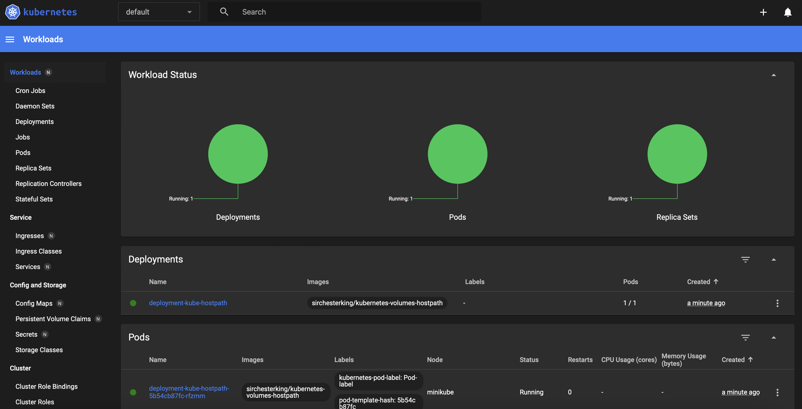

# Python Application Using <ins>**Kubernetes Cluster Volumes HostPath {}**</ins>

## Table Of Contents
* [Description](#description)
* [Main Application](#main_app)
* [Dockerfile](#dockerfile)
    - [Command Dockerfile](#command_file)
    - [Build Docker Image](#build_image)
* [Kubernetes Cluster](#kube_cluster)
    - [Kubernetes Components](#kube_components)
    - [Kubernetes API Server](#kube_api)
    - [Kubernetes Objects](#kube_objects)
    - [Kubernetes Volumes HostPath {}](#kube_volumes_hostpath)
    - [Kubectl](#kube_kubectl)
    - [Minikube - Local Kubernetes Cluster Instance](#minikube)
* [Run Python Application In The Pod](#run_python_app_pod)
* [Author](#author)

---
<a name="description"></a>
## Description

This application enables users to manage their personal data, including Name, Surname, Address, and Phone Number.<br>
It provides functionality for storing, viewing, and modifying user information. Data is stored in a file that is managed within a <mark>Kubernetes cluster</mark> using a <strong>hostPath</strong> volume specification.<br>
The primary objective of this application is to demonstrate the process of deploying, running, and managing data within a Kubernetes cluster.<br>
It operates through a command-line interface (CLI) rather than a graphical user interface (GUI).<br>
Application is structured as:
* Language: [Python](https://www.python.org)
* Container Engine: [Docker](https://www.docker.com)
* Orchestrator: [Kubernetes](https://kubernetes.io)

The Tree of application is:
- **`Project_Pythony/`**: The root directory of the project.
- **`Main_Code/`**: Contains the main application logic and all the modules.
- **`Classes/`**: Includes additional modules used by the main application.
- **`Dockerfile`**: Defines the Docker container setup for the project.
- **`Kubernetes_Deployment.yaml`**: Define the Kubernetes Cluster setup for the pods.
- **`README.md`**: Documentation for the project.
  
---
<a name="main_app"></a>
## Main Application
The application in the main page, show to user a menu list which he can choose.<br>
The input is via Terminal command.

```
menu_app = {
    "1": "Create new user",
    "2": "View list all users",
    "3": "Modify existing user"
}
```

As you can see, it was used a dictionary to use the pair <ins><em>Key: Values</em></ins> to bind the option with the
action.<br>
It be used a match statesman to call the proper function based on user's choice:

```
# Call the property function based on the user's chosen option.
match option_chosen:
    case "1":
        # Loop if the user wants to create a multiple "User Objects"
        loop_users = True

        while loop_users:
            # Clear the console.
            clear()
            create_user()

            while True:
                print("Do you want to create another User?")
                choose = input("Yes or No (y / n): ").lower()
                if choose == "y":
                    break
                if choose == "n":
                    loop_users = False
                    break
    case "2":
        # Clear the console.
        clear()
        list_all_users()
    case "3":
        # Clear the console.
        clear()
        modify_user()
    case _:
        return 0
```

---
<a name="dockerfile"></a>
## Dockerfile
This file contain all commands used to build the Image that Containers inside the Pods will use.<br>
The Image is a snapshot of the source code, and when it did build, the Image is in read-only mode, and you cannot change the code.<br>
If you want to create a container based to the new image, you must re-build the image.


<a name="command_file"></a>
### Command Dockerfile
The commands used to build the image that it'll be used to create the container that has the code, you must declare some
parameters.<br>
In this image it used the following commands:
- FROM
- LABEL
- WORKDIR
- COPY
- ENV
- RUN
- CMD

The <strong> FROM </strong> command it used to pull all dependenties based on the image that we pass as a parameter.<br>
In this case, we defined an image for a Python application, therefore with this command, we pull oll the dependenties from the <ins>official</ins> [Python Image](https://hub.docker.com/_/python), stored in
the [Docker Hub](https://hub.docker.com).

```
FROM python:latest
```

The word "<b> latest </b>" define to use the latest versione of the image we want to pull.
<br>

The <strong> WORKDIR </strong> command it used to define our work directory that all the <mark> next following command
in the Dockerfile </strong> will be executed.<br>

```
WORKDIR /Docker_Directory
```

The <strong> COPY </strong> command it used to say to Docker, that it must copy all the file stored in the same
directory of Dockerfile, to some directory in the container (that we pecified).

```
COPY . .
```

<br>

The <strong> ENV </strong> command it used to set the wanted variable to be include the wanted directory.

```
# Set the PYTHONPATH to include the "Docker_Directory" directory
ENV PYTHONPATH "${PYTHONPATH}:/Docker_Directory"

# Environment variables that will be used in the python application.
# To help to gather info for property works container.
ENV Path_Storage "/Docker_Directory/Storage"
ENV Name_File_Storage "User_Data.pkl"
```

<br>

The <strong> RUN </strong> command it used to run a specific command in the Container filesystem.

```
# Ensure the storage directory exists
RUN mkdir -p /Docker_Directory/Storage
```

<br>

The <strong> CMD </strong> command it used to say to Docker to run the command we specified in the dockerfile.

```
CMD ["python", "./Main_Code/main.py"]
```


<a name="build_image"></a>
### Build Docker Image
To build image, you must use the <strong> BUILD </strong> command, and pass where the dockerfile is stored, as a parameter.<br>

```
# If you ware in the same directory (as path) of where Dockerfile is stored, you can pass it as " . " argument.
docker build -t python_app_image .
```

<br>
To view the image was builted, you can view with the following command:

```
docker image ls
```

---
<a name="kube_cluster"></a>
## Kubernetes Cluster
[Kubernetes](https://kubernetes.io), also known as K8s, is an open source system for automating deployment, scaling, and management of containerized applications.<br>
A Kubernetes cluster consists of a control plane plus a set of worker machines, called nodes, that run containerized applications.<br>
Every cluster needs at least one worker node in order to run Pods.<br>

The worker node(s) host the Pods that are the components of the application workload. The control plane manages the worker nodes and the Pods in the cluster.<br>
In production environments, the control plane usually runs across multiple computers and a cluster usually runs multiple nodes, providing fault-tolerance and high availability.

For more details: [Cluster Architecture](https://kubernetes.io/docs/concepts/architecture/)


<a name="kube_components"></a>
### Kubernetes Components
A Kubernetes cluster consists of a control plane and one or more worker nodes.<br>
Here's a brief overview of the main components in the <mark>Control Plane</mark>:
- kube-apiserver: The core component server that exposes the Kubernetes HTTP API.
- etcd: Consistent and highly-available key value store for all API server data.
- kube-scheduler: Looks for Pods not yet bound to a node, and assigns each Pod to a suitable node.
- kube-controller-manager: Runs controllers to implement Kubernetes API behavior.

Here's a brief overview of the main components in the <mark>Node Plane</mark>:
- kubelet: Ensures that Pods are running, including their containers.
  


For more detail: [Kubernetes Components](https://kubernetes.io/docs/concepts/overview/components/)


<a name="kube_api"></a>
## Kubernetes Server API
The core of Kubernetes' control plane is the API server. The API server exposes an HTTP API that lets end users, different parts of your cluster, and external components communicate with one another.<br>
Most operations can be performed through the kubectl command-line interface or other command-line tools, such as kubeadm, which in turn use the API.<br>
However, you can also access the API directly using REST calls.<br>
Kubernetes provides a set of client libraries for those looking to write applications using the Kubernetes API.<br>

For more detail: [Kubernetes API](https://kubernetes.io/docs/concepts/overview/kubernetes-api/)


<a name="kube_objects"></a>
## Kubernetes Objects
Kubernetes objects are persistent entities in the Kubernetes system.<br> 
Kubernetes uses these entities to represent the state of your cluster.<br>
Specifically, they can describe:
- What containerized applications are running (and on which nodes)
- The resources available to those applications
- The policies around how those applications behave, such as restart policies, upgrades, and fault-tolerance

For more detail: [Kubernetes Objects](https://kubernetes.io/docs/concepts/overview/working-with-objects/)

<a name="kube_volumes_hostpath"></a>
## Kubernetes Volumes HostPath{}
The Kubernetes offers the possibilities to store data into a Work Node's Volume. In this case it used the <mark>HostPath {} Volume.</mark>.<br>
The volume mounts a directory or file <mark>from the host's filesystem into the pod</mark>.<br>
This is not something that most Pods will need, but it offers a powerful escape hatch for some applications.<br>

### Purpose
It allows to mount a directory or file from the host node's filesystem into the pod. This gives pods direct access to the host's storage, which can be persistent across pod restarts but is tied to the specific node.

### Data Persistance
<em>Persistent</em> (but limited): Data in a hostPath volume can persist across pod restarts because it's stored on the node's filesystem.<br>
However, if the pod is rescheduled to a different node, the data <mark>does not move</mark> with it, so it is "persistent" only while the pod stays on the same node.

### Use Cases
- Accessing files from the host's filesystem (for example, sharing configuration files, binaries, or logs).
- Use when the pod requires direct access to specific host paths, such as directories used by applications on the node, or when you need data to persist across pod restarts (on the same node).

### Security Considerations
Less secure because it grants the pod direct access to the host's filesystem. If misconfigured or given too much privilege, it could expose the host system to vulnerabilities from within the container. Limiting access to sensitive directories is essential.

### Lifecycle
The volume exists as long as the host node is running, independent of the pod lifecycle. If the pod is deleted, the data will remain on the host filesystem.

For more detail: [HostPath{} Volume](https://kubernetes.io/docs/concepts/storage/volumes/#hostpath)


---
<a name="kube_kubectl"></a>
## Kubectl
Kubernetes provides a command line tool for communicating with a Kubernetes cluster's control plane, using the Kubernetes API.<br>
This tool is <mark><ins>Kubectl</ins></mark>.<br>
For installation instructions, see [Installing kubectl](https://kubernetes.io/docs/tasks/tools/#kubectl); for a quick guide, see the cheat sheet.<br>

For more detail: [Kubectl](https://kubernetes.io/docs/reference/kubectl/)


---
<a name="minikube"></a>
## Minikube - Local Kubernetes Cluster Instance
Minikube is a tool that lets you run Kubernetes locally.<br>
Minikube runs an all-in-one or a multi-node local Kubernetes cluster on your personal computer (including Windows, macOS and Linux PCs) so that you can try out Kubernetes, or for daily development work.
To install Minikube you can follow the official guide: [Get Start](https://minikube.sigs.k8s.io/docs/start/)<br>
For more detail: [Minikube](https://minikube.sigs.k8s.io/docs/)<br><br>
After installation of Minikube, to start a local Kubernetes Cluster, follow the official guide: [Start Cluster](https://kubernetes.io/docs/tutorials/hello-minikube/)

---
<a name="run_python_app_pod"></a>
### Run Python Application
To run the python app, we need execute some steps before to do it.
- Run Minikube - Local Kubernetes Cluster Instance
- Verify the status of local Cluster
- Build the Docker image
- Push the Docker image to a public repository
- Deploy the Kubernetes Deployment
- Verify the status of deployments and pods
- Run the appllication

1) Run Minikube - Local Kubernetes Cluster Instance
Before run the application, we need to start our local Kubernetes Cluster.<br>
To do that, after the minikube installation, start the minikube with the following command:
```
minikube start
```

2) Verify the status of local Cluster
To verify the integrity of the local cluster, you have two ways:
- Minikube command
- Kubectl command

2.1) Using the minikube command, you must use:
```
minikube status
```
You will able to see:<br><br>

<br>
This explain is all up and running.

2.2) Using Kubectl command, you must use:
```
kubectl cluster-info
```

You will able to see:

This explain is all up and running.

3) Build the Docker Image
Tag the name of image a with the name the DockerHub Public Repository, that will be used by Kubernetes Deployment (in my case is: sirchesterking/kubernetes-volumes-hostpath).<br>
To build the Docker image, you must use the following command:
```
# We use the direectory " . ", 'cause when apply this command, we are int the same directory of Dockerfile.
docker build -t sirchesterking/kubernetes-volumes-hostpath .
```

To view the list of image:
```
docker image ls
```

4) Push the Docker image to a public repository
To use the image for our pods in the Cluster, we must use a public repository to pull the image and use it in the container's pods.<br>
In this case, we use the public repository on [Docker Hub](https://hub.docker.com).<br>
To pull the image, we need an accessible repository, so make sure to create a <b>public repository</b>.<br>
<br>

<b>Old Image</b>: python_app_image<br>
<b>New Image</b>: sirchesterking/kubernetes-volumes-hostpath (name of public repository)<br>

Before to push the image in the public repository, you must login via terminal to docker hub adn provide username and password:
```
docker login
```
<br>

After that, you can push the image in the public repository, using the following command:
```
# We provided the name:tag
docker push sirchesterking/kubernetes-volumes-hostpath
```

5) Deploy the Kubernetes Deployment
After the push of the image in the public repository, you can deploy the Kubernetes Deployment Object.<br>
To do that, you must create, before, the Deployment.yaml file, that will contain all the attributes and the specification of the desired behavior of the Deployment.
To review all the components inside the Deployment.yaml file, you can view [here](https://github.com/Sir-Chester-King/Python-Application-Using-Kubernetes-Volumes-HostPath/blob/main/deployment.yaml).<br>
To deploy the <strong>Deployment Object</strong> in the Kubernetes Cluster, you must use:
```
# After the -f option, you must provide the name of the Deployment.yaml file.
kubectl apply -f Kubernetes_Deployment.yaml
```

You will able to see via terminal:


6) View the Kubernetes Deployment
To view the <b>Deployment</b>, you have two ways:
- Kubectl command
- Minikube Dashboard

6.1) Kubectl command
Using the Kubectl command, you must use:
```
kubectl get deployment
```
You will able to see via terminal something like this:


6.2) Minikube Dashboard
To view the deployment via minikube, you can you the dashboard command, provided by minikube tool.<br>
To check, you must use:
```
minikube dashboard
```
You will able to see via terminal:


And after that, you can check it via browser using the URL provided in the terminal:


To view the <b>Pods</b> that are created automatically after the deployment (that's the power of the Kubernetes Orchestrator), you must use:
```
kubectl get pod
```


7) Run the appllication
After you did all the above steps, you can run the python application.<br>
To run the app inside the pod, inside the Kubernetes cluster, you must execute some commands via terminal:
```
kubectl get pod
```
To get the pod's name that you will use to run the python application.<br>
After:
```
kubectl exec -it <pod-name> -- /bin/bash
```
Where:
- pod-name: Replace this with the actual name of your pod.
- it: Combines the -i and -t flags to make the session interactive, like a terminal.
- /bin/bash: Starts a Bash shell. If your container uses a different shell (like sh), you can replace /bin/bash with that.

You will able to see via terminal:


As you can see, you now have access to a container inside the Pod.<br>
Go under the Main_Code directory using:
```
cd Main_Code/
```

Nnow, you can run the python application:
```
python Main_Code/main.py
```


Data address modified from "LondoAAAA" to "London"


If you have a multiple conatiner in the same Pod (because a Pod is a VM that can contain multiple containers), you must use:
```
kubectl exec -it <pod-name> -c <container-name> -- /bin/bash
```
To list the containers inside the Pod, you must use:
```
kubectl describe pod <pod-name>
```

In the output, look for a section like this:


As you can see, in the output of the code, it's able to see the mounted volume in the container


And


### View Data From WorkNode's FileSystem
You can see the data that are store inside the Work Node's filesystem using via terminal the following command:<br>
<mark>THIS WORKS ONLY IN MINIKUBE CLUSTER</mark>
```
minikube ssh
```

As you can see, you now in the worknode's filesystem, and you're able to see the "User_Data.pkl" inside the filesystem.
```
ls -l /data # To list all the file inside the /data directory inside the work node's filesystem.
```


---
<a name="author"></a>
## Author
- <ins><b>Nicola Ricciardi</b></ins>
